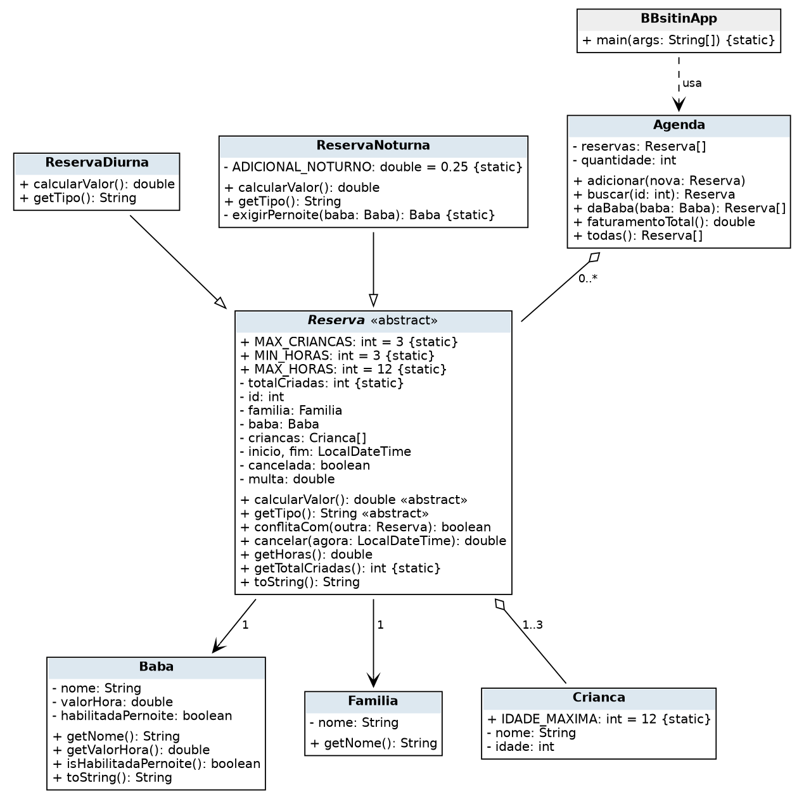

# BBsitin: agenda de reservas de babás

Aplicação de terminal que controla as reservas de uma plataforma de babás. Famílias reservam uma babá para cuidar de 1 a 3 crianças em um período diurno ou noturno. O sistema impede conflitos de horário, calcula o valor de cada reserva conforme o tipo, aplica a política de cancelamento e consolida o faturamento.

Autor: Marcello Azevedo Pinheiro Siqueira

## Casos de uso

1. **Criar reserva**: a família escolhe a babá, as crianças, o tipo (diurna ou noturna) e o horário. O sistema valida as regras e registra a reserva na agenda.
2. **Cancelar reserva**: a família cancela uma reserva pelo número. O sistema calcula a multa conforme a antecedência e marca a reserva como cancelada.
3. **Consultar agenda e faturamento**: o sistema lista todas as reservas, quantas reservas cada babá tem e o faturamento total (valores das reservas ativas mais multas das canceladas).

## Regras de negócio

1. Uma reserva deve durar no mínimo 3 horas e no máximo 12 horas.
2. Uma babá não pode ter duas reservas ativas com horários sobrepostos.
3. Cada reserva atende de 1 a 3 crianças, com idade de 0 a 12 anos.
4. Reserva noturna só pode ser feita com babá habilitada para pernoite e tem adicional de 25% sobre o valor da hora.
5. Na reserva diurna, o valor da hora aumenta 20% com 2 crianças e 40% com 3 crianças.
6. Cancelamento com menos de 24 horas de antecedência cobra multa de 50% do valor; com 24 horas ou mais, não há multa. Reserva já iniciada ou já cancelada não pode ser cancelada.

## Diagrama de classes



## Execução

```bash
cd projects/submissions/marcello-siqueira
mkdir -p bin
javac -d bin src/*.java
java -cp bin BBsitinApp
```

A execução é uma sequência de demonstração no `main` que percorre os três casos de uso com cenários válidos, inválidos e de fronteira (reserva de exatamente 3 horas com 3 crianças e cancelamento com exatamente 24 horas de antecedência).
